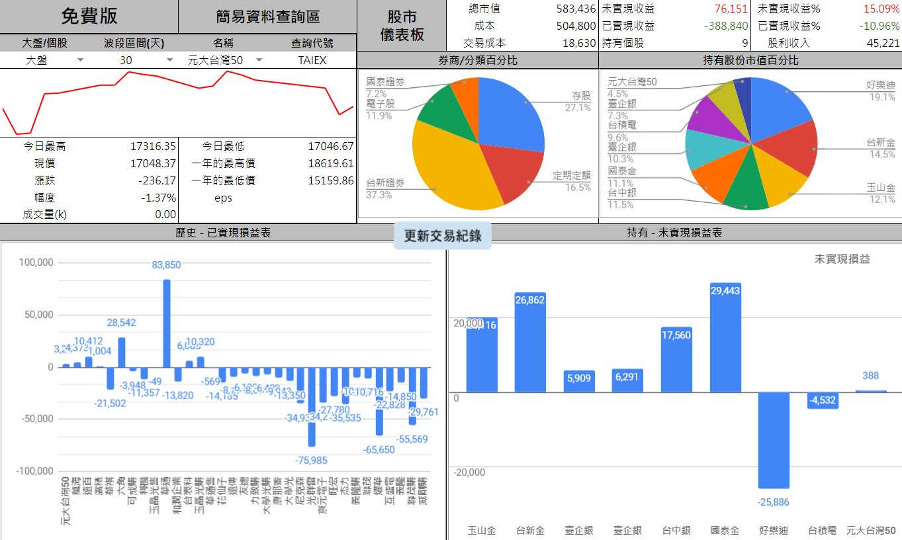
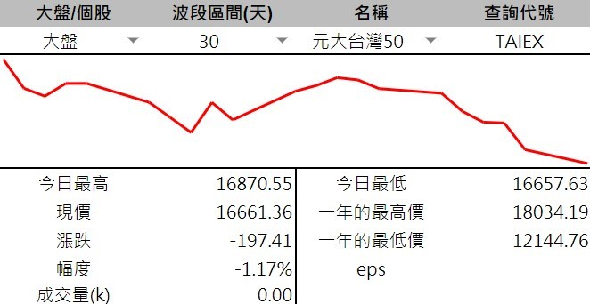
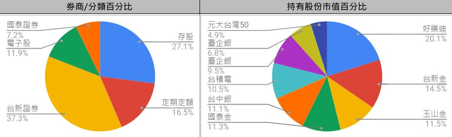
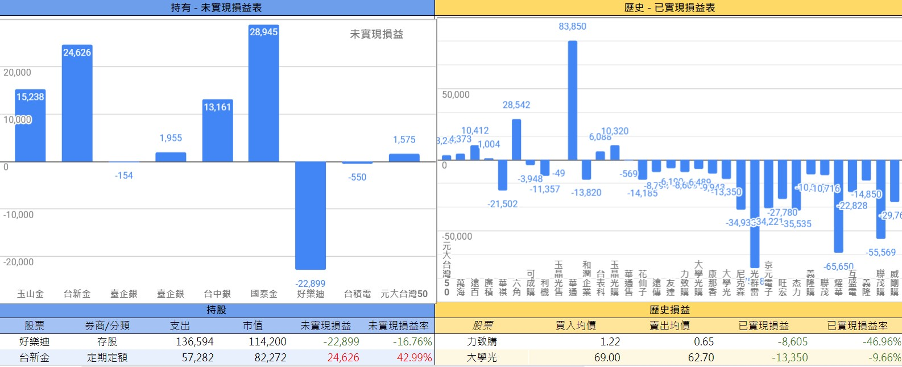
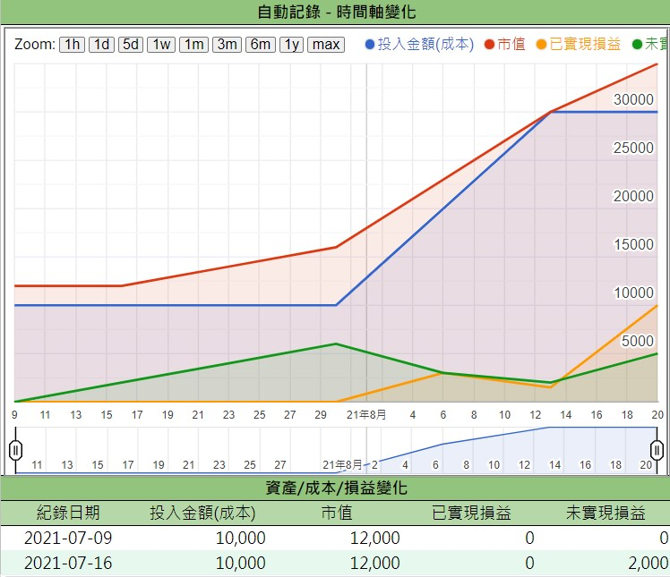

# 儀表板

  此頁的資訊多以 __最新成交價__ 做計算和呈現，只要一打開就能快速了解當下的持股狀況

  不用額外操作，試算表會自動計算

  

## 【更新交易紀錄】按鈕

  ::: tip 交易紀錄有更新就按一次
  :::

  交易紀錄有更新時，點此按鈕可快速更新【儀表板】、【持股】、【歷史損益】等頁面資料

  點按後的實際執行內容如下 :

 |   版本   | 持股分頁 | 歷史損益 |
|:------:|:--------:|:-------------: |
| 台股免費版  | 持股數不 = 0 |  持股數 = 0 |
| 台股收費版 | 未平倉       |  已平倉     |
 
 💡 因多了平倉功能，而有所不同

💡 執行動作與 **資料查詢區間** 有關
因歷史損益在區間為全部時只要篩選`已平倉`即可
但若有設定查詢區間則必須**計算區間內的買賣股數=0**才可以
所以若有設定過 **資料查詢區間** 要稍微注意一下以顯示資訊不正確

## 簡易查詢

  可查詢持有個股的資訊 ( 限上市公司 )

  
  
  大盤/個股 :
  - 選擇大盤 : 無論右邊個股名稱為何，一律顯示大盤指數資訊
  - 選擇個股 : 切換「名稱」可顯示持有個股的簡易資訊

## 持股百分比

  依據自己設定的券商和分類，自動以圓餅圖呈現，快速了解各類佔比
  
  

## 已/未實現損益

  

  - 未實現損益 : 基於最新的成交價，扣除成本之後的實際獲利。
    - 以0為中線區分上下的長條圖，(假設即刻賣出的話)上半部分是獲利，下半部分是虧損
  - 已實現損益 : 基於已經交易完畢的股票，計算實際入袋的獲利
    - 同未實現，可以一眼分辨獲利與否和獲利多寡

## <i class="fa-solid fa-star"/>自動記錄 <Badge type="warning" text="進階功能"/>

  定期將「投入成本」「市值」「已實現損益」「未實現損益」做紀錄。並以折現圖呈現

  方便觀察實際上是否有在獲利

  參考 [進階功能 > 功能 > 自動記錄](../PayOnly/進階功能.md#自動記錄)

  
