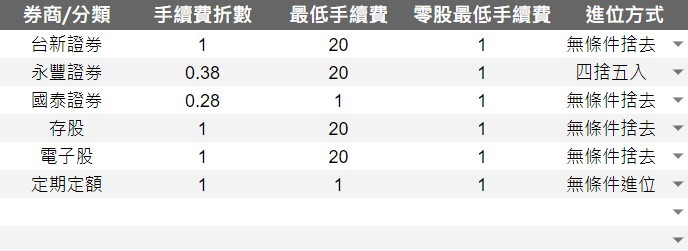

# 券商與分類
  
  

 - **股票分類** : 
   - 除了可以同時設定不同的券商外，也能透過此功能，將股票進行分類
 - 手續費折數
   - 數字1為沒有折扣， **打8折** 請輸入 `0.8` 以此類推...
 - 零股最低手續費
   - 同最低手續費，但零股交易手續費經常低於20元，因此各券商在零股部分最低手續費有可能是1元
 - ⭐融資券 : 
   - 融資券的成本費用，各券商也有所不同。皆在此設定
   - 參考 [進階功能 > 功能 > 融資券](../PayOnly/進階功能.md#融資券)
 - 下方列表是股票交易基本的手續費。試算表內也有

|   交易成本   |  手續費  | 交易稅 |  申購  | 股利  |
|:--------:|:-------:| :---: |:----:|:---:|
|  收取時機   |買進、賣出| 賣出  | 申購成功 | 發放時 |
|  費率    | 0.1425% | 0.30% |  70  | 10  |
 |  ETF.權證  | 0.1425% | 0.10% |  -   |  -  |
 |  債券型ETF  | 0.1425% | 0.00% |  -   |  -  |
 |  當沖　　   | 0.1425% | 0.15% |  -   |  -  |
 |  收取最低   |   20    |  -   |  -  |  -   |
 |  備註　　   |各券商有不同折扣|無條件捨去|  -   |  -  |