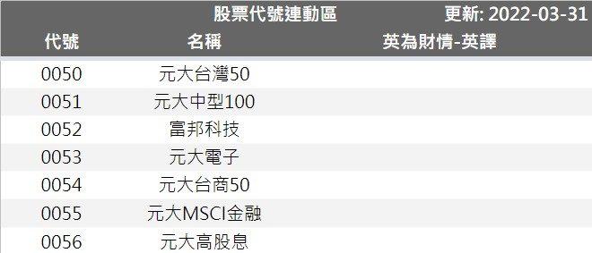

# 股票代號

 ::: warning 此分頁不需要任何更動，股票代號會自動同步更新
 :::
 

 - 自動更新股票代號
   - 更新來源 : 參考 [上櫃取價互助表](#上櫃取價互助表)
 - 自動取得最新成交價
   1. 取價來源為查詢股票的平台或網站，屬於爬蟲技術
   2. 為避免單一來源造容易造成取價失敗，已建立多個來源網站
      ::: details 取價順序
      Google財經 > 基本市況報導網站(mis.tse) > 嗨投資(histock) > 鉅亨網(cnyes) > 英為財情(investing)
      :::
   3. 取價網站若是同時間死掉或是更改網站架構，有可能造成無法取價的結果
   4. 因爬蟲技術違反股票網站的利益(沒有實際觀看網站，無法獲取廣告利潤等)
      - 若需要查價的股票很多，且在短時間查詢太多次，有可能造成短時間內無法取價
      - 全自動化版已將爬蟲次數改善並降至最低，一般使用不會輕易超過其使用量
      - 若無法取價，通常等待一段時間(或幾天)後。就會自己恢復

### 上櫃取價互助表

 ::: tip (台股)免費/收費版 的股票代號都與此試算表保持同步和更新
 :::
 - [上櫃取價互助表](https://docs.google.com/spreadsheets/d/1gPp3MOwiIpfs5FVDnLXIq2b9UizYjbkPCSAjnlkzVdQ)
 - 此表為所有使用者共同維護和更新
 - 因股票代號會不段變化(新公司上市櫃，公司倒閉下市等) → 為使更新和維護更加自動化而建立

##### 使用說明

 ::: danger 不要新增權證的代號，權證無法取得現價
 想使用權證的請至 [客制化 > 權證版](../Version/客製化.md#台股權證版)
 :::

 1. 使用[Google表單](https://forms.gle/jJdaWMeouEQJyAvy8)進行填寫和更新
 2. 表單填寫完畢後，到【股票代號-取值】分頁確認是否有正常更新

##### 補充						
 1. 若是才剛上市/上櫃的股票，查詢網站可能還來不及新增該股票的資料。有可能會查不到現價，而出現錯誤或無法顯示。等查詢網站新增了之後就可以取得現價了	
 2. ETF部分，英為財情的查詢網址不同，且原先google的函式已可取值。因此不需填「英為財情-英譯」欄位
 3. 英為財情網站無法查詢特別股，若知道有哪個網站可以爬現價也可另外告知懶魚

 ps. **上櫃取價互助表** → 有任何異狀請直接 [聯繫懶魚](../../Contact.md#聯繫懶魚)

##### 英為財情
 
- 該網站的查詢方式並非台灣所使用的統一股票代碼，而是網站自行命名的英文名稱。
- 若股票代號出現<Badge text="請輸入英譯" vertical="middle"/>字樣，請依**上櫃取價互助表**的【英譯範例】分頁取得該股票的英文名稱，再填寫[Google表單](https://forms.gle/jJdaWMeouEQJyAvy8)