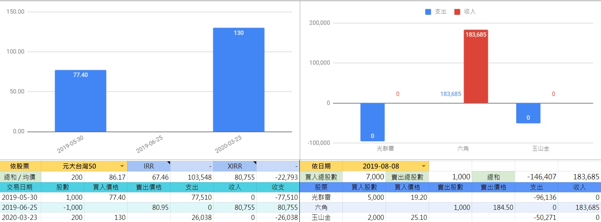
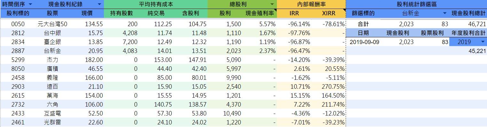
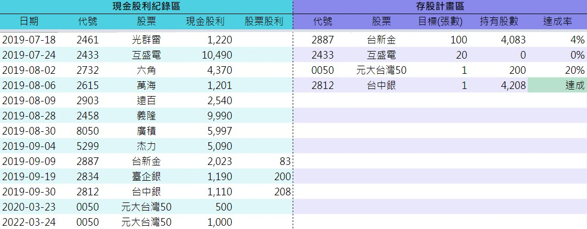
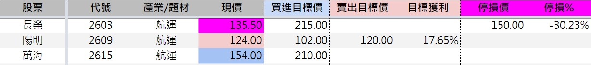

# 功能

#### 功能目錄
 [[toc]]

## 自動記錄

 ::: warning 需啟用一鍵更新並授權後，才能使用此功能
 參考 : [快速上手 > 步驟3 - 啟用一鍵更新 ( 含自動取價 )](../QuickStart/%E5%BF%AB%E9%80%9F%E4%B8%8A%E6%89%8B.html#%E6%AD%A5%E9%A9%9F3-%E5%95%9F%E7%94%A8%E4%B8%80%E9%8D%B5%E6%9B%B4%E6%96%B0-%E5%90%AB%E8%87%AA%E5%8B%95%E5%8F%96%E5%83%B9)
 :::

 

 ::: tip 紀錄時間拉長之後，將會自動轉換成走勢圖，方便觀察
 :::

 - 將以下四種資料做定期紀錄
   1. 投入成本
   2. 市值
   3. 已實現損益
   4. 未實現損益
 - 固定在每周五 > 23:00 到 24:00 之間 > 自動記錄下當時的數據
 - 需於周五收盤後主動打開一次此表
   - 使市值、未實現損益等能以周五最新的成交價去做計算
 - 圖表的時間軸與區間可自行調整

## 統計

 

### 快速篩選
 - 依股票
 - 依日期

### 內部報酬率
 - IRR : 定期式的現金流量。例:年/月 → 年報酬率/月報酬率
 - XIRR : 非定期式的現金流量

 💡 什麼是 [內部報酬率(維基百科)](https://zh.wikipedia.org/wiki/%E5%85%A7%E9%83%A8%E5%A0%B1%E9%85%AC%E7%8E%87) → 計算一段時間內，現金流的報酬率的一種算法

 ::: tip 若資料不齊全，內部報酬率將會無法計算。會出現錯誤屬正常現象
 :::

## 現金股利

 

 現金股利，在成本計算上與一般股票交易截然不同。若想確實計算的話，切分開來是比較適當的

 ex. 二代健保補充保費、併入個人綜合所得稅(依每個人的收入級距不同，會有成本上的差距)等

 加上台灣人喜歡存股的人不少，因此特地設置的存股計畫區以符合大多數人的需求

 ::: tip 股票股利，請分開記錄在【交易紀錄】→ 欄位<Badge text="買/賣" vertical="middle"/>選擇「股票股利」，欄位<Badge text="買入價格" vertical="middle"/>不用輸入
 :::
 
 主要分為三大區塊
 1. 篩選、自動計算區塊
 2. [現金股利記錄區](../PayOnly/%E5%8A%9F%E8%83%BD.html#%E7%8F%BE%E9%87%91%E8%82%A1%E5%88%A9%E8%A8%98%E9%8C%84%E5%8D%80) > 需手動紀錄
 3. [存股計畫區](#存股計畫區) > 需手動紀錄

 - 【篩選、自動計算區塊】

   此區塊可以自由切換要顯示的股票標的是「現金股利紀錄」(全部) or 「存股計畫區」(只篩選出計劃內的股票標的)

   **可篩選的條件有**
   1. 排序 : 依時間正 / 倒序、無排序
   2. 股利總和 : 總股利 / 今年
   3. 股利統計篩選 : 方便查看單一個股所有的股利紀錄
   4. 年度股利 : 查詢各年度現金股利總和

 - 平均持有成本
   - 純交易 : 不含現金股利
   - 含股利 : 包含累計的現金股利(依總股利 / 今年)，去計算平均持有成本。(領越多平均持有成本越低)
 - 現金殖利率
   - 依(總股利 / 今年)計算現金殖利率

#### 現金股利記錄區
 
 圖左
 

 此區塊需手動輸入，為單存紀錄的區塊
 > 若含有股票股利，(因股票股利可以再次交易)需額外在【交易紀錄】內紀錄股票股利的部分

### 存股計畫區

 圖右
 

 能為自己設定目標。ex. 哪一檔股票，要存多少張數
 > 設定後會自動依據記錄區計算達成率，在超過100%時會自動變成「醒目的達成」

## 平倉
 
 【交易紀錄】的<Badge text="平倉" vertical="middle"/>欄位

 ::: tip 此設計是為了同一檔股票有多次進出的時
 為了能區別判斷同一檔股票最新一次的交易(排除過去)的損益為何而設計的
 :::

 平倉功能的有無，會影響「未實現損益」的計算和【持股】、【歷史損益】的分類方式

 舉例 :

  日期      |   進出   |持股張數| 成交價  | 設定  |
 :---------:|:--------:|:-----:|:-----:|:-----:|
 2020/01/05 | 買進10張 | 10 張 |  10元  |<Badge type="tip" text="已平倉" vertical="middle"/>|
 2020/01/06 | 賣出10張 |  0 張 |  15元  |<Badge type="tip" text="已平倉" vertical="middle"/>|
 2020/02/20 | 買進10張 | 10 張 |  20元  |<Badge type="warning" text="未平倉" vertical="middle"/>|

 平倉功能有無的差異
 - 沒有平倉功能
   - 平均成本 　: 15元 = 成本價20元-1月份每張賺5元
   - 未實現損益 : 10元 = 25 - 15 (假設) 現價是25元
   - 持股分類 　: 股數總和不為 0 → 持股 / 股數總和為 0 → 歷史損益 
 - 有平倉功能
   - 平均成本 　: 20元 → 將過去的損益與現在的切開來
   - 未實現損益 : 5元 = 25 - 20 (假設) 現價是25元
   - 持股分類 　: 未平倉 → 持股 / 已平倉 → 歷史損益

 > 平倉功能可以更精確的計算，現有持股的未實現損益，以確保每次交易都能確實獲利

#### 如何設定平倉/已平倉

 買進/賣出，需要剛好能互相抵消。即買進股數-賣出股數 = 0

::: details 💡 平倉設定的演變流程

 - 在1/6時

  日期      |    進出   |持股張數| 設定 | 
 :---------:|:---------:|:----:|:-----:|
 2020-01-05 | 買進10 張 | 10 張 |<Badge type="warning" text="未平倉" vertical="middle"/>
 2020-01-06 | 買進 5 張 | 15 張 |<Badge type="warning" text="未平倉" vertical="middle"/>

 - 在1/7時 → 與1/6剛好能抵銷，兩天都設定成「已平倉」

  日期      |    進出   |持股張數| 設定 | 
 :---------:|:---------:|:----:|:-----:|
 2020-01-05 | 買進10 張 | 10 張 |<Badge type="warning" text="未平倉" vertical="middle"/>
 2020-01-06 | 買進 5 張 | 15 張 |<Badge type="tip"     text="已平倉" vertical="middle"/>
 2020-01-07 | 賣出 5 張 | 10 張 |<Badge type="tip"     text="已平倉" vertical="middle"/>

 - 在1/9時 → 1/8.9連續賣出，但無法與剛好與先前買進的相互抵銷，因此先擱著

  日期      |    進出   |持股張數| 設定 |
 :---------:|:---------:|:----:|:-----:|
 2020-01-05 | 買進10 張 | 10 張 |<Badge type="warning" text="未平倉" vertical="middle"/>
 2020-01-06 | 買進 5 張 | 15 張 |<Badge type="tip"     text="已平倉" vertical="middle"/>
 2020-01-07 | 賣出 5 張 | 10 張 |<Badge type="tip"     text="已平倉" vertical="middle"/>
 2020-01-08 | 賣出 3 張 | 7 張  |<Badge type="warning" text="未平倉" vertical="middle"/>
 2020-01-09 | 賣出 2 張 | 5 張  |<Badge type="warning" text="未平倉" vertical="middle"/>
 2020-01-10 | 賣出 5 張 | 0 張  |<Badge type="tip"     text="已平倉" vertical="middle"/>

 - 在1/10時 → 因5/8/9/10這4天加起來總和 = 0 ( 可以完全抵消 ) → 當天將這4天交易的筆數全部改設成「已平倉」

  日期      |    進出   |持股張數| 設定 |
 :---------:|:---------:|:----:|:-----:|
 2020-01-05 | 買進10 張 | 10 張 |<Badge type="tip"     text="已平倉" vertical="middle"/>
 2020-01-06 | 買進 5 張 | 15 張 |<Badge type="tip"     text="已平倉" vertical="middle"/>
 2020-01-07 | 賣出 5 張 | 10 張 |<Badge type="tip"     text="已平倉" vertical="middle"/>
 2020-01-08 | 賣出 3 張 | 7 張  |<Badge type="tip"     text="已平倉" vertical="middle"/>
 2020-01-09 | 賣出 2 張 | 5 張  |<Badge type="tip"     text="已平倉" vertical="middle"/>
 2020-01-10 | 賣出 5 張 | 0 張  |<Badge type="tip"     text="已平倉" vertical="middle"/>
 > 在2020-01-10時已經全部改成已平倉，在這時間點之後之後，即使再次交易0050
 所看到的未實現損益會是 **「只計算之後未平倉的部分」**，把2020-01-10以前損益的部分(已平倉)區分開來
:::

## 觀察

 

 可將觀察的口袋名單，記錄在此頁
 - 可設定 買進 / 賣出 / 停損 的目標價位
 - 若成交價在設定的價格範圍內，會自動以相同的顏色做出醒目提醒
 - 可在最後觀察重點記錄下為何關注，以及要關注什麼等筆記

## 融資券
 
 建置中