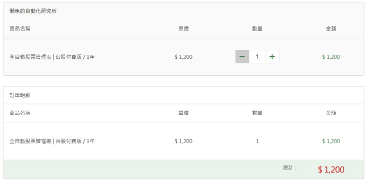
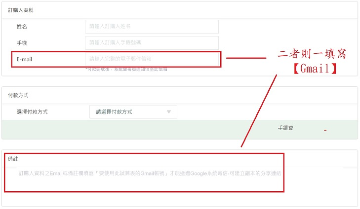
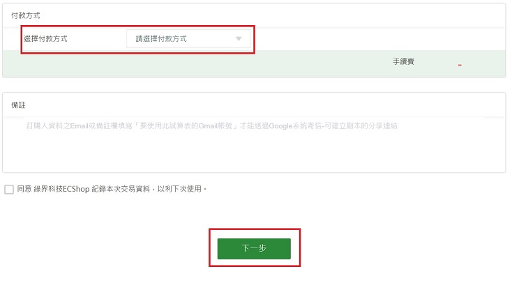
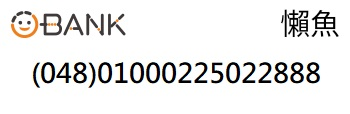
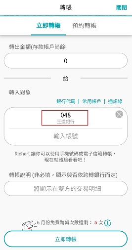
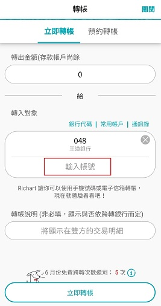
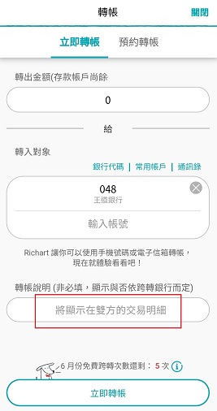
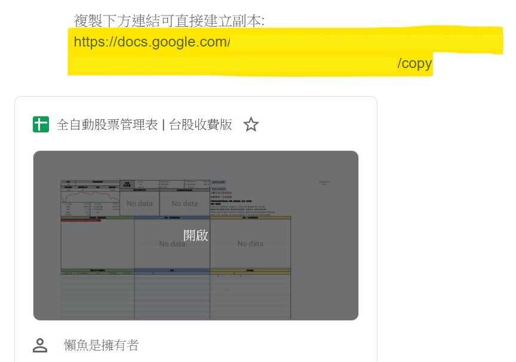

# 購買

> 兩種版本都會**綁定Google帳號**。不同帳號，無法共用

#### 台股收費版

 ::: tip $ 1,200 / 年。訂閱制，訂單完成當日起算往後一年
 購買數量為訂閱的年份數，例 : 下單的購買數量2 → 即為訂閱2年。以此類推..
 :::
 - 預覽用 [台股收費版](https://docs.google.com/spreadsheets/d/1HQE6sgELw7jaiaUFFG-Rlf1bIdRpr4RNo1d43duKRr8)
 - 參考 [版本 > 台股收費版](/Version/免費版.md)

#### 美股收費版

 ::: warning $ 2,000。買斷制，不同於收費版的年費
 :::
 - 預覽用 [美股收費版](https://docs.google.com/spreadsheets/d/1tRNgBzPeiY8uIptyv7b59INGh-3ffm-yWGMO9GR77ak)
 - 參考 [版本 > 美股收費版](/Version/%E7%BE%8E%E8%82%A1%E7%89%88.md)

## 付款方式

#### 信用卡 - 訂單連結

 - [台股收費版](https://cart.cashier.ecpay.com.tw/qp/ntY1)
 - [美股收費版](https://cart.cashier.ecpay.com.tw/qp/naqB)

   ::: details 信用卡 - 流程示意圖
   1. 商品訂單畫面

   

   1. 填寫Gmail

    該Gmail帳號就是要使用此excel表的Google帳號。以便透過Gmail發送email分享「可建立副本」的連結
   
   
   1. 可選擇付款方式 ex.信用卡

   

   1. 完成後續結帳步驟
   :::

#### APP轉帳/數位銀行轉帳

  收款帳戶 : 王道銀行

  

  ::: details 數位銀行轉帳 - 流程示意圖
   1. app轉帳 ex.Richart
   2. 填入銀行代碼 - 048

   

   3. 填入銀行帳號 - 01000225022888

   

   4. 填入備註 - Gmail帳號

   

    例:kevin@gmail.com
    則填入「台股kevin」
    若太長則填入「台股付費版」並將匯款成功的畫面截圖存證。
    另寄emil通知(含截圖存證.Gmail.轉帳日期)

   5. email - __pickupcamry@gmail.com__

      內容要包含
    - 轉帳日期
    - 銀行代碼及轉帳末五碼(截圖存證)
    - 要使用的Gmail
   :::

#### 電子商城 - 商品連結

 - [台股收費版(蝦皮)](https://shopee.tw/Google%E8%A9%A6%E7%AE%97%E8%A1%A8%E3%80%90%E5%85%A8%E8%87%AA%E5%8B%95%E8%82%A1%E7%A5%A8%E7%AE%A1%E7%90%86%E8%A1%A8-%E5%8F%B0%E8%82%A1%E4%BB%98%E8%B2%BB%E7%89%88%E3%80%91%F0%9F%93%9DExcel-%E8%82%A1%E7%A5%A8%E7%AE%A1%E7%90%86-%E7%AF%84%E6%9C%AC-%E8%87%AA%E5%8B%95%E5%8C%96-%E8%82%A1%E7%A5%A8%E8%A8%98%E5%B8%B3-%E8%82%A1%E7%A5%A8%E6%95%B4%E7%90%86-%E8%82%A1%E7%A5%A8%E6%90%8D%E7%9B%8A-i.150537601.9985869773?position=1)
 - [美股收費版(蝦皮)](https://shopee.tw/Google%E8%A9%A6%E7%AE%97%E8%A1%A8%E3%80%90%E5%85%A8%E8%87%AA%E5%8B%95%E8%82%A1%E7%A5%A8%E7%AE%A1%E7%90%86%E8%A1%A8-%E7%BE%8E%E8%82%A1%E4%BB%98%E8%B2%BB%E7%89%88%E3%80%91%F0%9F%93%9DExcel-%E8%82%A1%E7%A5%A8%E7%AE%A1%E7%90%86-%E7%AF%84%E6%9C%AC-%E7%BE%8E%E8%82%A1-%E8%82%A1%E7%A5%A8%E8%A8%98%E5%B8%B3-%E8%82%A1%E7%A5%A8%E6%95%B4%E7%90%86-%E8%82%A1%E7%A5%A8%E6%90%8D%E7%9B%8A-i.150537601.3195478292?sp_atk=e1dab470-61cc-4acb-adc1-abae42693845)

## 付款後開通

 付款且待懶魚確定訂單後，會透過Google發送系統通知信件到指定的Gmail信箱
 ::: details email示意圖
  - 信件
  
  - 信件內會有付費版的複製用連結
    - 請將黃底色的網址，貼在瀏覽器網址列上，直接enter前往
  
 :::
 ::: tip 有此連結之後，後續作法和免費版一致
  參考 [快速上手 > 建立自己的試算表](../QuickStart/第一次使用.md#建立自己的試算表)
 :::