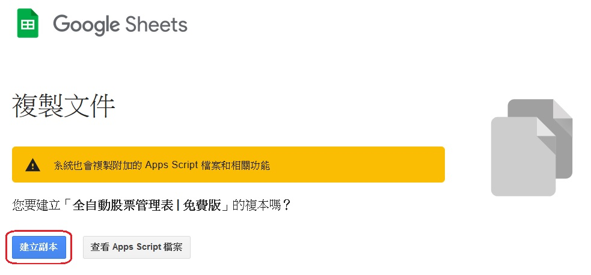
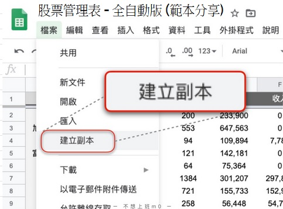

# 快速上手

  .jpg)

## 各版本預覽

  - 預覽用 [台股免費版](https://docs.google.com/spreadsheets/d/1ykPXyjFSCEZon7MEuOiDpEK1hdW1JQH5VGCnbtaAmDQ) → 
    複製用 [台股免費版](https://docs.google.com/spreadsheets/d/1rchpA3W-BlDn8BZOhQ1uiUPnuHLb4UZ65iLzjHb-cp0)
  - 預覽用 [台股收費版](https://docs.google.com/spreadsheets/d/1HQE6sgELw7jaiaUFFG-Rlf1bIdRpr4RNo1d43duKRr8)
  - 預覽用 [美股收費版](https://docs.google.com/spreadsheets/d/1tRNgBzPeiY8uIptyv7b59INGh-3ffm-yWGMO9GR77ak)
  - [客製化版](../PayOnly/test1.md)

## 建立自己的試算表

#### 步驟1 - 建立副本

  ::: tip 收費版： 在確認收款後將會透過Google寄出系統email，信件內含可建立收費版的連結
  :::

  方法1: 連結 → [`建立副本用`](https://docs.google.com/spreadsheets/d/1rchpA3W-BlDn8BZOhQ1uiUPnuHLb4UZ65iLzjHb-cp0/copy)

  1. 點選上方連結 
  2. 點選畫面中的藍色按鈕 `建立副本`
    

  ::: details 方法2: 在試算表左上角 → 點選檔案 → 建立副本
  
  :::

#### 步驟2 - 給自己的管理表一個新的名子
   ::: tip 將「全自動股票管理表 | 免費版 - 副本」← 改名
   :::

#### 步驟3 - 啟用一鍵更新 ( 含自動取價 )
   - 在試算表內點選【儀表版】分頁的按鈕 __`更新交易紀錄`__ → 點選 __「進階」__ → 點選  __「前往取得股票現價(不安全)」__ → 點選按鈕 __`允許`__
   - 允許後再次點選【儀表版】分頁的按鈕 __`更新交易紀錄`__，確認功能正常
   
   ::: details 啟用示意圖
   
   
   
   
   :::

   ::: warning 💡 如有安全上的疑慮，請勿使用此範本。因為不授權基本上這份範本主要功能都不能使用
   ps. 所有非Google的原生功能(額外添加的)，Google一律會跳出此警告
   :::

## 券商與分類

  - 此表會依據不同券商的手續費折扣/零股最低手續費去做計算。因此在建立好自己的試算表後，必須先將自己常用的券商先做好設定

  - 之後再做買賣紀錄的時候，就能直接選擇券商。公式會直接帶入並計算，增加計算成本上的精準度

   ::: tip 除了券商外，也可以利用此功能。將自己的股票分類
   例如: 電子股、定期定額(存股)、金融股等。這些分類會在儀表板以圓餅圖顯示各分類佔比
   :::