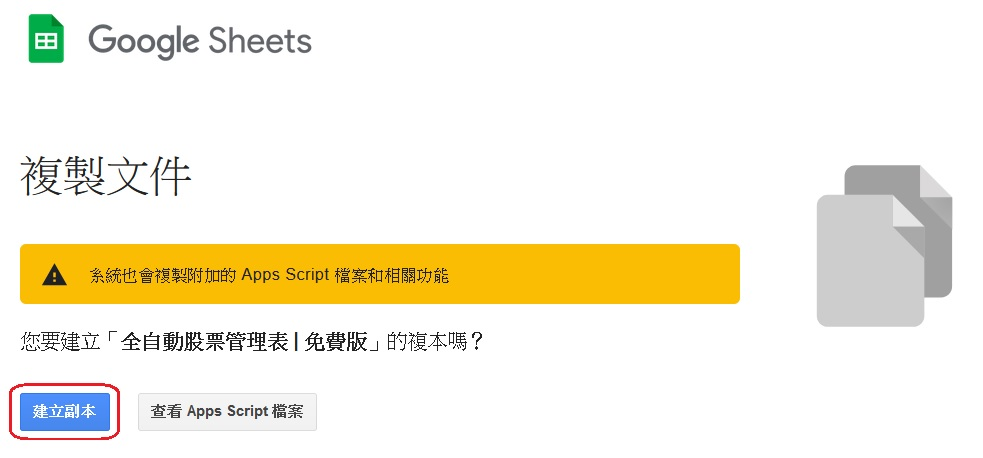
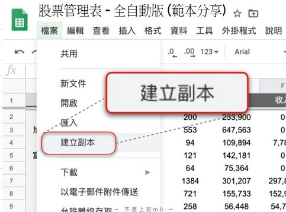

# 第一次使用

  @slidestart

  #### [台股收費版](https://docs.google.com/spreadsheets/d/1HQE6sgELw7jaiaUFFG-Rlf1bIdRpr4RNo1d43duKRr8)
  
  .jpg)

  ---
  
  #### [台股免費版](https://docs.google.com/spreadsheets/d/1ykPXyjFSCEZon7MEuOiDpEK1hdW1JQH5VGCnbtaAmDQ)
  .jpg)
  <!-- .element: class="r-stretch" -->

  ---

  #### [美股收費版](https://docs.google.com/spreadsheets/d/1tRNgBzPeiY8uIptyv7b59INGh-3ffm-yWGMO9GR77ak)
  

  ---

  #### [跨市場股票總覽](https://docs.google.com/spreadsheets/d/1IQi4lzuMhBs-crrWWCkOKGOziw5QHLoJHXu9T84U6kY)

  

  參考 [客製化 > 跨市場股票總覽](../../Version/%E5%AE%A2%E8%A3%BD%E5%8C%96.html#%E8%B7%A8%E5%B8%82%E5%A0%B4%E8%82%A1%E7%A5%A8%E7%B8%BD%E8%A6%BD)

  @slideend

  ::: info 上方投影片
  - 點按藍色標題可直接連結至範本預覽
  - 點按右下角圖示可切換版本預覽圖
  :::

## 建立自己的試算表

#### 步驟1 - 建立副本

  ::: tip 收費版： 在確認收款後將會透過Google寄出系統email，信件內含可建立收費版的連結
   參考 [進階功能 > 購買 > 付款後開通](../PayOnly/購買.md#付款後開通)
  :::

  方法1: 連結 → <Badge text="台股免費版" vertical="middle"/>[建立副本用](https://docs.google.com/spreadsheets/d/1rchpA3W-BlDn8BZOhQ1uiUPnuHLb4UZ65iLzjHb-cp0/copy)

  1. 點選上方連結 
  2. 點選畫面中的藍色按鈕 `建立副本`
    

  ::: details 方法2: 在試算表左上角 → 點選檔案 → 建立副本
  
  :::

#### 步驟2 - 給自己的管理表一個新的名子
   ::: tip 將「全自動股票管理表 | 免費版 - 副本」← 改名
   :::

#### 步驟3 - 啟用一鍵更新-含自動取價
   - 在試算表內點選【儀表版】分頁的按鈕 <Badge text="更新交易紀錄" vertical="middle"/> → 點選 __「進階」__ → 點選  __「前往取得股票現價(不安全)」__ → 點選按鈕 <Badge text="允許" vertical="middle"/>
   - 允許後再次點選【儀表版】分頁的按鈕 <Badge text="更新交易紀錄" vertical="middle"/> 確認功能正常
   
   ::: details 啟用示意圖
   1. 在試算表內點選【儀表版】分頁的按鈕 <Badge text="更新交易紀錄" vertical="middle"/>

   

   2. 點選 __「進階」__ (未經驗證部分可參考 [補充說明](#補充說明))

   

   3. 點選  __「前往取得股票現價(不安全)」__

   

   4. 點選按鈕 <Badge text="允許" vertical="middle"/>

   
   :::

##### 補充說明

   ::: warning 為了使試算表能更加方便，有寫入一些程式碼做輔助
   ex.「抓取現價」「一鍵更新」「收費版的自動記錄並圖表化」等，這些功能會需要相應的授權才能使用

   此範本已有眾多的人在使用，程式碼也有經過他人的建議和檢核請放心使用

   ps. 即使如此仍有疑慮的話，請勿使用此範本
   :::

## 券商與分類

  - 此表會依據不同券商的手續費折扣/零股最低手續費去做計算。因此在建立好自己的試算表後，必須先將自己常用的券商先做好設定

  - 之後再做買賣紀錄的時候，就能直接選擇券商。公式會直接帶入並計算，增加計算成本上的精準度

   ::: tip 除了券商外，也可以利用此功能。將自己的股票分類
   例如: 電子股、定期定額(存股)、金融股等。這些分類會在儀表板以圓餅圖顯示各分類佔比
   :::