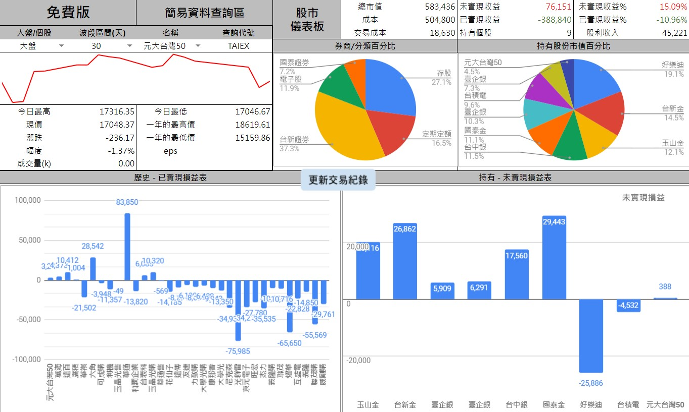

# 台股免費版

 

## 連結

  - 預覽用 [台股免費版](https://docs.google.com/spreadsheets/d/1ykPXyjFSCEZon7MEuOiDpEK1hdW1JQH5VGCnbtaAmDQ) → 
    複製用 [台股免費版](https://docs.google.com/spreadsheets/d/1rchpA3W-BlDn8BZOhQ1uiUPnuHLb4UZ65iLzjHb-cp0)

## 功能

1. 自動取價 → 自動取得股票最新成交價
2. 多樣化圖表
3. 一鍵更新
4. 簡易個股查詢
5. 只需做好交易紀錄，試算表會自動計算報酬率
6. 設定多個券商，精準的以不同券商計算手續費
7. 可將持有股票進行分類，自動產生分類占比的圓餅圖

以上功能 
- 參考 [指南 > 基本功能](../Introduction/儀表板.md)

## 使用方式

- 參考 [指南 > 快速上手](../QuickStart/快速上手.md#建立自己的試算表)
