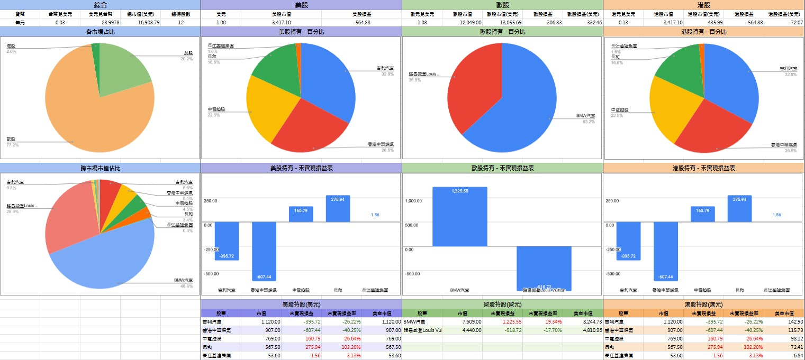

# 客製化

基於台股免費版，針對個人需求的「客製化」。調整or再次提升功能性(依個人想法新增功能)

範例在下面，開放預覽

## 客製化流程

1. [聯繫懶魚](../Contact.md#聯繫懶魚) 並提供相關想法與資料
2. 依據需求的【功能】or【調整】內容提出所需的費用
3. 確定下單 > 收取【訂金】
4. 開始製作 > 過程會隨時討論
5. 【驗收版】確認內容，是否符合需求
6. 驗收完成 > 給付剩餘款項 > 【客製化正式版】

## 客製化案例

案例目錄
- [跨市場總覽(同步多個股票管理表)](客製化.md#跨市場總覽)
- [台股權證版](客製化.md#台股權證版)
- [美股客製版](客製化.md#美股客製版)
- [港股版](客製化.md#港股版)
- [歐股版](客製化.md#歐股版)

### 跨市場總覽
  
  - [預覽連結](https://docs.google.com/spreadsheets/d/1IQi4lzuMhBs-crrWWCkOKGOziw5QHLoJHXu9T84U6kY)
  - 可同步多個股票管理表，統一瀏覽和查詢，如下圖

    

    1. 總覽：跨excel取得連動，可將另外三個股票管理表的資料同步到本excel內並自動整理&計算。
    2. 儀表板：可切換(美股+港股+歐股)直接觀看
    3. 將各市場的市值佔比做整體計算
    4. 交易紀錄：將(美股+港股+歐股)的交易紀錄統整進一起(同步連動)

    💡 因為需要指定跟哪一個股票管理表做資料連動，因此購買此範本需要簡易教學

### 台股權證版

  - [預覽連結](https://docs.google.com/spreadsheets/d/1uIzjgipsAJl9ZEB5jUdOiloLhx0bZAXobWcNnhS5vok)
  - 說明
    - 權證代號變更很快，且有期限。
    - 原本的股票代號 <Badge type="danger" text="不可以" vertical="middle"/> 新增權證代號
      - 參考 [基本功能 > 股票代號](/StockProfolioDocs/Introduction/股票代號.md)
    - 因需求而客製化了「權證版」
  - 使用方式
    - 在「權證分頁」可輸入權證代號及其中文名稱
    - 新增好權證代號後，在「交易紀錄」即可直接key權證代號。會自動帶出中文和現價
    - 現價 > 必須手動輸入 ( 一個代號，需一次/每日 )
    💡 因權證找不到可以爬蟲的取價網站，所以只能手動輸入。若能提供可改成自動取價
    > 目前嘗試許多網站都無法取得權證現價，可取得網站之條件:
    > 1. 網址後面必須要有權證代號(以便查詢個別權證現價)
    > 2. 必須要是靜態網站

### 美股客製版

  - [預覽連結](https://docs.google.com/spreadsheets/d/16Ygy_nbilindLc0bmEbKoblAAUCyJlonHCTvbh1_exw)
  - 客製化內容
    - 加入每一筆交易的匯率並自動換算成台幣
    - 提供換匯分頁，方便記錄與記帳

### 港股版

  - [預覽連結](https://docs.google.com/spreadsheets/d/1CbcYsptitfv0QHnUEnf_iPCZefv17xEEM1rCYkoSZOY/edit?usp=sharing)
  - 客製化內容
    1. 加入港股指數-恆大.國企
    2. 股票代號改成港股版
    3. 取得限價 - 抓取港股股票價錢(港元)
    4. 增加觀察股票的分頁

### 歐股版

  - [預覽連結](https://docs.google.com/spreadsheets/d/1i8iHfY1dR44tHlM4COFP-rURwwMLaDZhGZUAPS3NFZ0/edit?usp=sharing)
  - 客製化內容
    1. 股票代號改成歐股版
    2. 取得限價 - 抓取歐股股票價錢(歐元)
    3. 增加觀察股票的分頁

