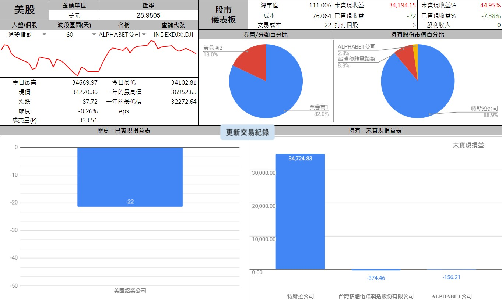

# 美股收費版

## 連結

- 預覽用 [美股收費版](https://docs.google.com/spreadsheets/d/1tRNgBzPeiY8uIptyv7b59INGh-3ffm-yWGMO9GR77ak)

## 功能

::: tip 功能同台股免費版
:::

不同的是
1. 取價改為美股網站
2. 整份試算表的幣別為「美金」
3. 儀表板 - 新增可查詢【道瓊指數】【那斯達克】💡【費半指數】【美股個股】的簡易資料
4. 儀表板新增美金兌台幣的匯率
5. 股票代號採手動自行更新
6. <i class="fa-solid fa-star"/>平倉功能

💡【費半指數】> 此指數目前google方的圖表資料有誤，只有下面數字。沒有圖表

其他基本功能
- 參考 [指南 > 基本功能](../StockProfolioDocs/Introduction/儀表板.md)

## 如何使用

1. 購買 - 參考 [進階功能 > 購買 > 付款方式](../StockProfolioDocs/PayOnly/購買.md#付款方式)
2. 啟用 - 參考 [進階功能 > 購買 > 付款後開通](../StockProfolioDocs/PayOnly/購買.md#付款後開通)

## 費用

 ::: tip $ 2,000。買斷制，限用於一個Google帳號
 :::

- 購買連結
  - [美股收費版(信用卡)](https://cart.cashier.ecpay.com.tw/qp/naqB)
  - [美股收費版(蝦皮)](https://shopee.tw/Google%E8%A9%A6%E7%AE%97%E8%A1%A8%E3%80%90%E5%85%A8%E8%87%AA%E5%8B%95%E8%82%A1%E7%A5%A8%E7%AE%A1%E7%90%86%E8%A1%A8-%E7%BE%8E%E8%82%A1%E4%BB%98%E8%B2%BB%E7%89%88%E3%80%91%F0%9F%93%9DExcel-%E8%82%A1%E7%A5%A8%E7%AE%A1%E7%90%86-%E7%AF%84%E6%9C%AC-%E7%BE%8E%E8%82%A1-%E8%82%A1%E7%A5%A8%E8%A8%98%E5%B8%B3-%E8%82%A1%E7%A5%A8%E6%95%B4%E7%90%86-%E8%82%A1%E7%A5%A8%E6%90%8D%E7%9B%8A-i.150537601.3195478292?sp_atk=e1dab470-61cc-4acb-adc1-abae42693845)